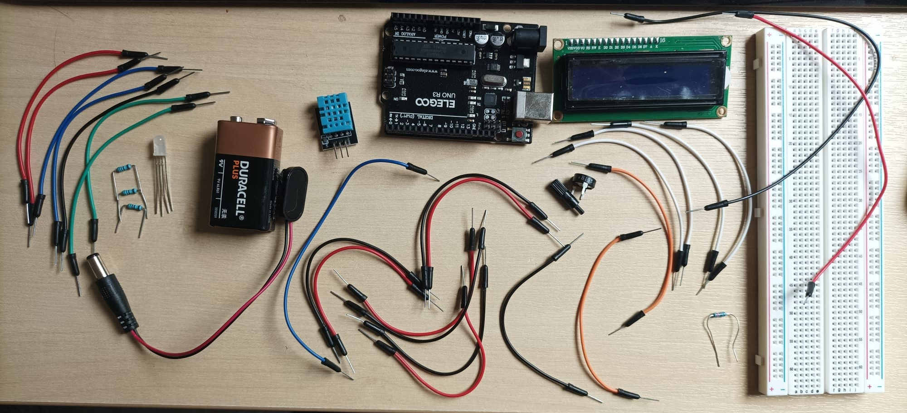
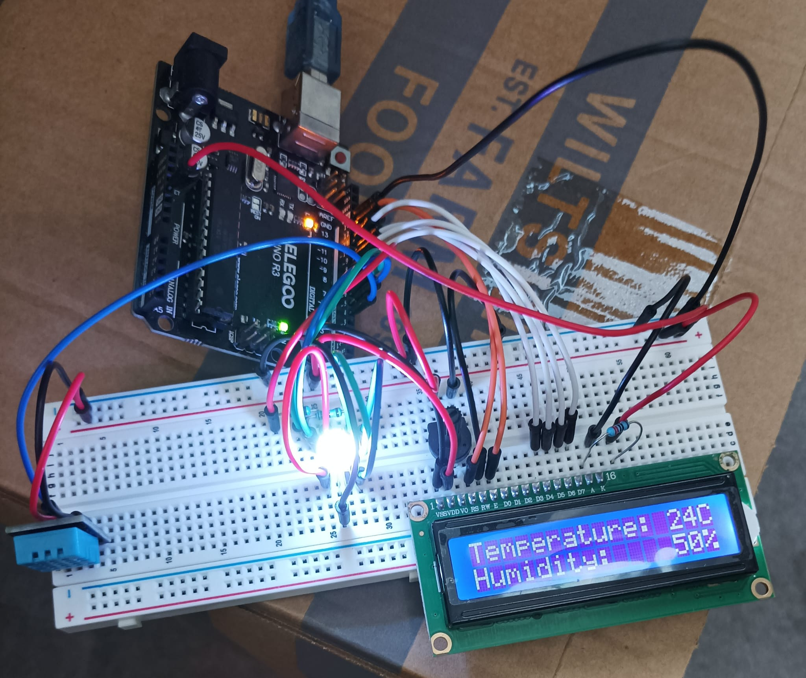

# Thermometer-Arduino

This is my version of a thermometer and hygrometer. In this repository, you will find two versions: with and without an LED. 

## Prerequisites of what you need;

(Items with a star (*) at the end represent parts that aren't used in the partial version)
* 1- UNO R3 Controller Board
* 1- DHT11 (USE 5k Ohm resistor ONLY IF IT HAS 4 PINS)
* 1- Potentiometer 10K
* 1- LCD1602 (with pin header)
* 1- 220 Ohm resistor (for LCD)
* 25- Breadboard Jumper Wire (less of the LED is not used)
* 1- RGB LED*
* 3- 150 Ohm resistor*
* (optional) 9v battery + snap-on connector

## Assembly setup
If you want to assemble it yourself, you will need either to buy each part separately or buy the full [Super Starter Kit UNO R3 Project](https://eu.elegoo.com/products/elegoo-uno-project-super-starter-kit)

> [!WARNING]
> Because wokwi.com doesn't have a DHT11 sensor, I used DHT22 instead. All it means is that you need to check which pins to connect and adjust the sensor accordingly. If you are using DHT11 from the kit, the pins for the VCC(power) and data will be reversed as Data, VCC, Ground. 

Follow the link to the [full version](https://wokwi.com/projects/468250562996590593) or the [partial version](https://wokwi.com/projects/468253565850216449). This will be your guide on how to connect everything. Next, connect the USB Cable to the Arduino and the machine(Computer) with a USB port (this step is needed to write code from your machine to the Arduino board) 

## Software setup

Install [Arduino IDE](https://www.arduino.cc/en/software/)
> [!IMPORTANT]
> Don't forget to install DHT11 library. I have installed and used the library by Dhruba Saha for DHT11, and if you are using DHT22 you will need to install and configure your own library. To add a library, inside the IDE go to "tools -> manage libraries" and in the window "Filter your search "DHT11". You can use any library, just make sure you change the code to work with that particular library.

### Full version setup
If you are using the full version with an LED, [download the file](Thermometer_full_version.ino), then inside Arduino IDE, press "File -> Open..", select the location where you saved the Thermometer_full_version.ino file. After the file is opened, press the upload button (->), and you are set.

### Partial version setup
If you are using the partial version without an LED, [download the file](Thermometer_partial_version.ino), then inside Arduino LED, press "File -> Open..", select the location where you saved Thermometer_partial_version.ino. After the file is opened, press the upload button (->), and you are set.

Below you can see the working version of the full thermometer.

> [!IMPORTANT]
> The LED is set very abruptly and should ideally be configured specially for your needs.
>
> Right now, the LED has the following modes;
> * Ideal - Green
> * Hot - Red
> * Cold - Blue
> * Humid - Orange
> * Dry - Purple
> * Chaos - White (hot and humid or cold and dry)
